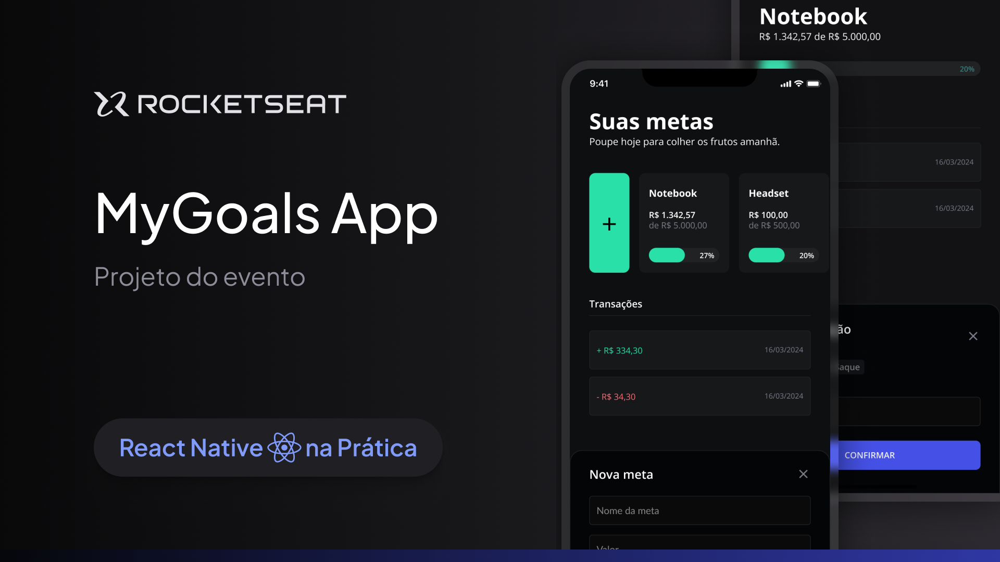

# My Goals App



## About the project

This is a simple app that allows users to create and manage their goals. Users can create new goals, track their progress. Built in Expo(React Native) and SQLite, the app is designed to be user-friendly and easy to use.

### Built With

[![Expo][Expo]][Expo-url]

[![React-Native][React-Native]][React-Native-url]

[![Nativewind][Nativewind]][Native-Wind-url]

[![SQLite][SQLite]][SQLite-url]

## Getting Started

Follow the steps below to run the project.

### Prerequisites

To run this project, you will need:

* npm

  ```sh
  npm install npm@latest -g
  ```

### Installation


1. Clone the repo
 ```sh
git clone https://github.com/EdlanioJ/my-goals.git
```

2. Install NPM packages
```sh
npm install
```

### Run

Run in [Expo Go](https://expo.dev/go)

```js
npx expo start
```

Run in a Emulator

```ts
// iOS Emulator
npx expo run:ios

// Android Emulator
npx expo run:android

```

## Usage

Follow the steps below to use the app.

### Create a New Goal

1. Tap the "+" button.
2. Enter a name for your goal in the text field and how much to achieve the goal. 
3. Tap the "Create" button to save your goal.


### Track Your Progress

1. Tap the Goal you want to track and check.
2. Tap the "New transaction" button to add a transaction.
3. Enter the amount of the transaction and tap the "Add" button to save it.
4. Tap the "Back" button to go back.


<!-- ROADMAP -->
## Roadmap

- [x] Goal

  - [x] Create
  - [x] Get By Id
  - [x] Get All
- [x] Transaction
  - [x] Create
  - [x] Get Latest 
  - [x] Get By Goal ID


## Layout

You may view the layout of this project through this [link :link:](https://www.figma.com/file/iIy0UkeW0TdFwYWEBbYePp/MyGoals-App-(Community)?type=design&node-id=7-2&mode=design&t=2452LiaiM5a9wkqc-0). You must have an account at [Figma](https://figma.com) to access it.

## License

This project is under the MIT license. See the [LICENSE](LICENSE) file for more details.
<br/>

Made with :heart: por [Edlâneo Manuel](https://github.com/EdlanioJ) :wave:


[React-Native]: https://img.shields.io/badge/React%20Native-61DAFB?style=for-the-badge&logo=react&logoColor=ffffff
[React-Native-url]: https://reactnative.dev/

[Expo]: https://img.shields.io/badge/Expo-000000?style=for-the-badge&logo=expo&logoColor=ffffff
[Expo-url]: https://expo.io/

[React-Query]: https://img.shields.io/badge/React_Query-ef4842?style=for-the-badge&logo=tanstack&logoColor=ffffff
[React-Query-url]: https://tanstack.com/query

[Nativewind]: https://img.shields.io/badge/Nativewind-20232A?style=for-the-badge&logo=tailwind-css&logoColor=ffffff
[Native-Wind-url]: https://www.nativewind.dev/

[SQLite]: https://img.shields.io/badge/SQLite-074059?style=for-the-badge&logo=sqlite&logoColor=ffffff

[SQLite-url]: https://www.sqlite.org/index.html